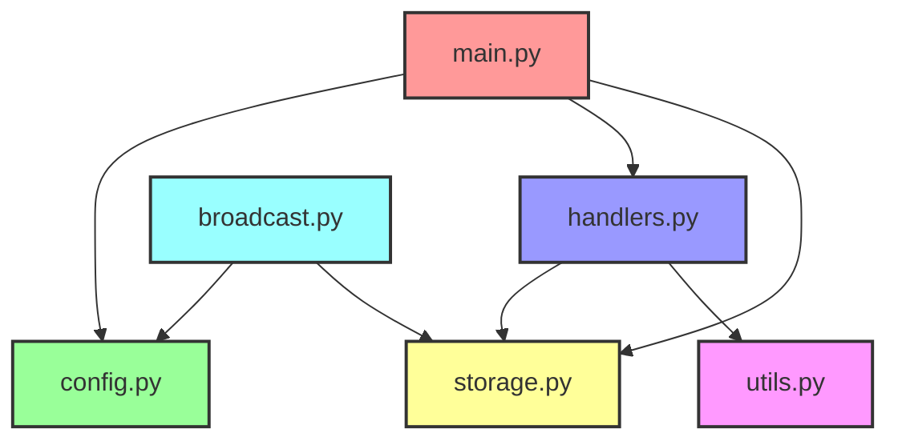

# Техническое задание: Телеграм-бот для кибердэнс мастер-класса

## Обзор
Нам нужно создать Телеграм-бот для нашего предстоящего кибердэнс мастер-класса. Бот будет регистрировать пользователей, назначать им роли и предоставлять информацию о событии участникам. Бот должен быть простым в реализации, но достаточно надёжным, чтобы справиться примерно с 50 одновременными пользователями.

## Структура проекта
Бот будет написан на Python и состоять из нескольких модулей:



## Описание структуры бота:
Эта диаграмма показывает, как связаны разные части нашего Телеграм-бота:

1. `main.py` (Красный): Это начальная точка нашего бота. Он использует информацию из config.py и настраивает команды, определенные в handlers.py.
2. `config.py` (Зеленый): Этот файл содержит важные настройки для бота, например, его секретный токен.
handlers.py (Синий): Здесь находится код, который определяет, что бот должен делать, когда получает разные команды. Он использует `storage.py` для сохранения или получения информации и `utils.py` для вспомогательных функций.
3. `storage.py` (Желтый): Здесь мы храним информацию обо всех пользователях и их ролях. И `handlers.py`, и `broadcast.py` используют этот файл для работы с данными пользователей.
4. `utils.py` (Розовый): Здесь находятся полезные функции, которые использует `handlers.py`, например, для назначения ролей или получения информации о событии.
5. `broadcast.py` (Голубой): Это отдельный скрипт, который может отправлять сообщения всем пользователям. Ему нужна информация из `config.py`, и он использует `storage.py`, чтобы узнать, кому отправлять сообщения.

Стрелки показывают, какие файлы используют или нуждаются в информации из других файлов. Например, main.py нужна информация из config.py и handlers.py для правильной работы.

## Подробные требования
### 1. `main.py`
Это главный файл нашего бота.
Задачи:

- Подключить нужные модули и настроить бота
- Определить обработчики команд
- Запустить бота

Пример структуры:
```python
from telegram.ext import Updater, CommandHandler
from modules import handlers
from config import BOT_TOKEN

def main():
    updater = Updater(BOT_TOKEN, use_context=True)
    dp = updater.dispatcher

    # Добавляем обработчики команд здесь
    dp.add_handler(CommandHandler("start", handlers.start))
    # Добавьте больше обработчиков...

    updater.start_polling()
    updater.idle()

if __name__ == '__main__':
    main()
```
### 2. `config.py`
Здесь храним настройки.
Задачи:

- Задать `BOT_TOKEN`
- Задать путь к файлу `DATA_FILE`

Пример:

```python
BOT_TOKEN = "ВАШ_ТОКЕН_БОТА"
DATA_FILE = "data/users.json"
```
### 3. `handlers.py`
Этот модуль будет содержать все функции-обработчики команд.
Задачи:

- Реализовать обработчики для команд: `/start`, `/register`, `/role`, `/info`, `/mission`
- Каждый обработчик должен взаимодействовать с `storage.py` для сохранения или получения данных

Пример обработчика:

```python
from modules import storage, utils

def start(update, context):
    user_id = update.effective_user.id
    if storage.user_exists(user_id):
        update.message.reply_text("С возвращением, оперативник.")
    else:
        update.message.reply_text("Приветствую, новобранец. Используй /register для регистрации.")
```

### 4. `storage.py`
Этот модуль будет отвечать за хранение и получение данных.
Задачи:

- Реализовать функции для сохранения и получения данных пользователей
- Использовать файловое хранилище (JSON)
- Реализовать механизм блокировки для обработки одновременного доступа

Основные функции для реализации:

- `save_user(user_id, role)`
- `get_user(user_id)`
- `user_exists(user_id)`
- `get_all_user_ids()`

Пример механизма блокировки:

```python
import json
import os
from contextlib import contextmanager

LOCK_FILE = "data/users.json.lock"

@contextmanager
def file_lock():
    while os.path.exists(LOCK_FILE):
        time.sleep(0.1)
    try:
        open(LOCK_FILE, 'w').close()
        yield
    finally:
        if os.path.exists(LOCK_FILE):
            os.remove(LOCK_FILE)

def save_user(user_id, role):
    with file_lock():
        # Загрузить существующие данные, обновить и сохранить
```

### 5. `utils.py`
Этот модуль будет содержать вспомогательные функции.
Задачи:

- Реализовать функцию назначения роли
- Реализовать функции для генерации информации о событии и заданиях

Пример:

```python
import random

def assign_role():
    return random.choice(["Хакер", "Защитник"])

def get_event_info():
    return "Кибердэнс мастер-класс: Дата будет объявлена, Место: Засекречено"
```
### 6. `broadcast.py`
Этот скрипт позволит отправлять сообщения всем пользователям из командной строки.
Задачи:

- Реализовать функцию для отправки сообщения всем зарегистрированным пользователям
- Принимать сообщение как аргумент командной строки

Пример использования:

```bash
python broadcast.py defenders "Событие начинается через 1 час. Подготовьте свои нейроинтерфейсы!"
```
### Тестирование

- Проверьте каждую команду, чтобы убедиться, что она работает как ожидается
- Протестируйте одновременный доступ, чтобы проверить работу механизма блокировки
- Проверьте функцию рассылки

### Развертывание

- Убедитесь, что все зависимости установлены (библиотека `python-telegram-bot`)
- Настройте токен бота в `config.py`
- Запустите `main.py`, чтобы запустить бота

### Дополнительные заметки

- Следуйте руководству по стилю [PEP 8](https://peps.python.org/pep-0008/)
- Комментируйте свой код для ясности
- Аккуратно обрабатывайте исключения
