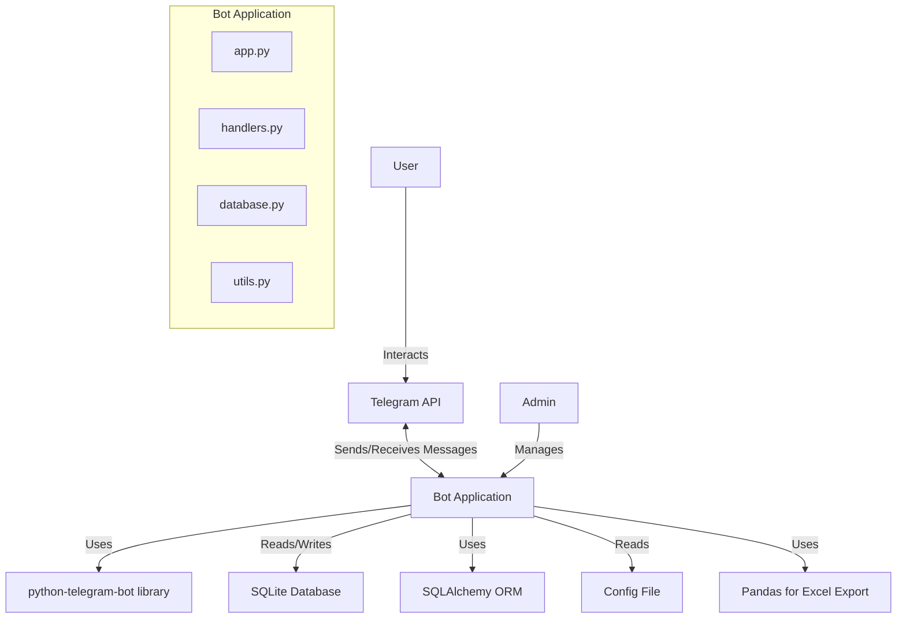
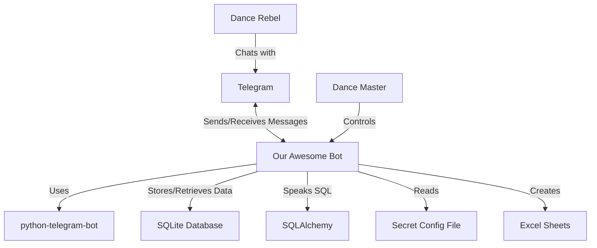

# Cyberpunk Dance Class Telegram Bot
## What's This All About?
Imagine organizing a surprise cyberpunk-themed dance class where participants are divided into "hackers" and "defenders". Sounds cool, right? That's exactly what this Telegram bot helps you do! It's your digital assistant for managing registrations, sending out mysterious invitations, and keeping everyone in the loop about this exciting event.

## What Can This Bot Do?
- 📝 Sign up new dance rebels (ahem, participants)
- 🎭 Assign secret roles: are you a hacker or a defender?
- 📨 Send out cryptic invitations automatically
- 🆘 Handle any cries for help (support requests)
- 👑 Give the event organizer superpowers to manage everything
- 📊 Create fancy Excel sheets with all the participant data
- 💬 Send custom messages that fit the cyberpunk theme
- 🔔 Keep everyone updated about the upcoming dance revolution

## The Tech Behind the Scenes
For the curious minds, here's what makes our bot tick:

- Python 3.8+ (the language of the future!)
- SQLAlchemy (for talking to databases in a cool way)
- SQLite (our secret data vault)
- python-telegram-bot (for Telegram wizardry)
- pandas (not the animal, but for Excel magic)

## Library Structure
### Bot Architecture Diagram

## User Flow
Here's a sneak peek at how our digital dance party is organized:

## Getting the Bot Ready to Dance

- Clone this digital dance floor: `git clone [your-repo-url]`
- Install the cool gadgets: `pip install -r requirements.txt`
- Set up your secret codes (environment variables)
- Initialize the data vault: `python init_db.py`
- Let the bot loose: `python bot.py`

## How Participants Join the Dance

- Scan a mysterious QR code or click a secret link
- Chat with the bot and share your rebel identity
- Wait for the Dance Master to assign your role
- Receive a cryptic invitation
- Get hyped with event updates and instructions
- After the dance-off, receive your battle footage

## For the Dance Master (Admin Powers)

- Send out invitations to your chosen rebels
- Decide who's hacking and who's defending
- Export your rebel database to Excel
- Send secret messages to specific groups
- Handle any SOS signals from lost dancers

## SQLite Integration
The bot application interacts with the SQLite database using SQLAlchemy ORM (Object-Relational Mapping). This integration allows for efficient data management and retrieval.

Here's how it works:

1. Database Connection: The bot establishes a connection to the SQLite database using SQLAlchemy's create_engine function.
1. ORM Models: We define Python classes that represent database tables (`User`, `MessageTemplate`, `SupportRequest`, `AdminMessage`). These classes inherit from SQLAlchemy's declarative_base().
1. Session Management: SQLAlchemy sessions are used to manage database transactions. We use a sessionmaker to create sessions as needed.
1. CRUD Operations: The bot performs `Create`, `Read`, `Update`, and `Delete` operations on the database using SQLAlchemy's ORM methods. For example:
    - Creating a new user: `session.add(User(...))`
    - Querying users: `session.query(User).filter_by(...).first()`
    - Updating user roles: `user.role = new_role`
    - Deleting records: `session.delete(user)`
1. Transaction Handling: SQLAlchemy manages transactions, ensuring data integrity. We use `session.commit()` to save changes and `session.rollback()` in case of errors.
1. Connection Pooling: SQLAlchemy handles connection pooling automatically, optimizing database access.
1. SQL Generation: While we primarily use ORM methods, SQLAlchemy can also generate raw SQL when needed, as demonstrated in our role update function.
